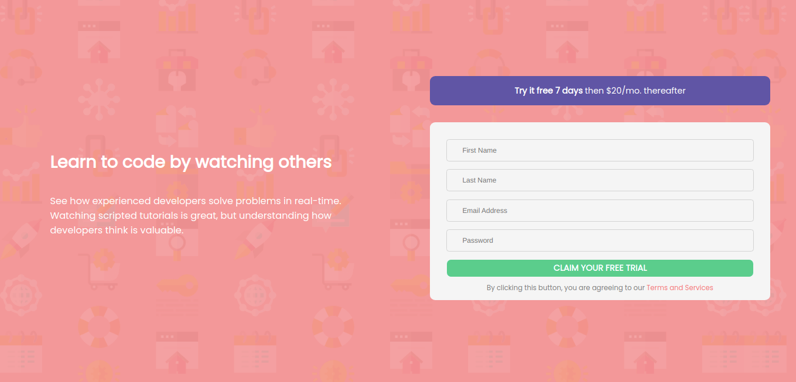

# Frontend Mentor - Intro component with sign up form solution

This is a solution to the [Intro component with sign up form challenge on Frontend Mentor](https://www.frontendmentor.io/challenges/intro-component-with-signup-form-5cf91bd49edda32581d28fd1). Frontend Mentor challenges help you improve your coding skills by building realistic projects.

## Table of contents

- [Overview](#overview)
  - [The challenge](#the-challenge)
  - [Screenshot](#screenshot)
  - [Links](#links)
- [My process](#my-process)
  - [Built with](#built-with)
  - [What I learned](#what-i-learned)
  - [Continued development](#continued-development)
  - [Useful resources](#useful-resources)
- [Author](#author)
- [Acknowledgments](#acknowledgments)

**Note: Delete this note and update the table of contents based on what sections you keep.**

## Overview

### The challenge

Users should be able to:

- View the optimal layout for the site depending on their device's screen size
- See hover states for all interactive elements on the page
- Receive an error message when the `form` is submitted if:
  - Any `input` field is empty. The message for this error should say _"[Field Name] cannot be empty"_
  - The email address is not formatted correctly (i.e. a correct email address should have this structure: `name@host.tld`). The message for this error should say _"Looks like this is not an email"_

### Screenshot



### Links

- Solution URL: [Add solution URL here](https://your-solution-url.com)
- Live Site URL: [Add live site URL here](https://your-live-site-url.com)

## My process

### Built with

- Semantic HTML5 markup
- CSS custom properties
- Flexbox
- CSS Grid
- Mobile-first workflow
- [React](https://reactjs.org/) - JS library

### What I learned

I learned how to make more user attractive buttons with css using box shadow effect and transaleY

```css
.button {
  width: 100%;
  height: 45px;
  font-family: Poppins;
  font-size: medium;
  text-transform: uppercase;
  letter-spacing: 2.5px;
  font-weight: bolder;
  color: #fff;
  background-color: hsl(154, 59%, 51%);
  border: none;
  border-radius: 8px;
  box-shadow: 0px 8px 15px rgba(0, 0, 0, 0.1);
  transition: all 0.3s ease 0s;
  cursor: pointer;
  outline: none;
}

.button:hover {
  background-color: #2ee59d;
  box-shadow: 0px 15px 20px rgba(46, 229, 157, 0.4);
  color: #fff;
  transform: translateY(-7px);
}
```

### Continued development

in the next projects I will be focusing on using Snackbars to validation messages and errors.

**Note: Delete this note and the content within this section and replace with your own plans for continued development.**

## Author

- Website - [Bret Mwenda](https://www.reckonKE.com)
- Frontend Mentor - [@yourusername](https://www.frontendmentor.io/profile/yourusername)
- Twitter - [@mwendarr](https://www.twitter.com/mwendarr)
